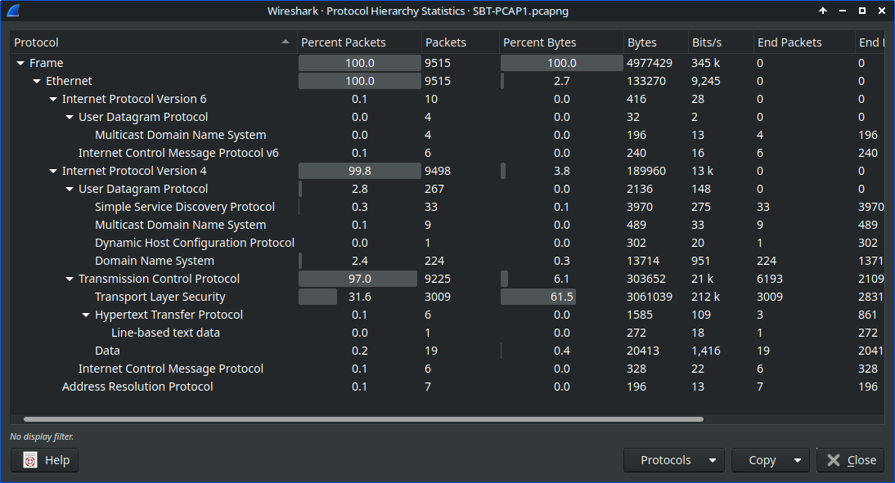
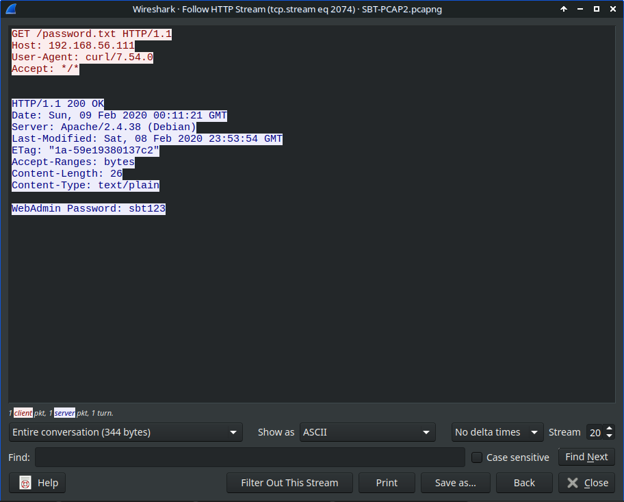
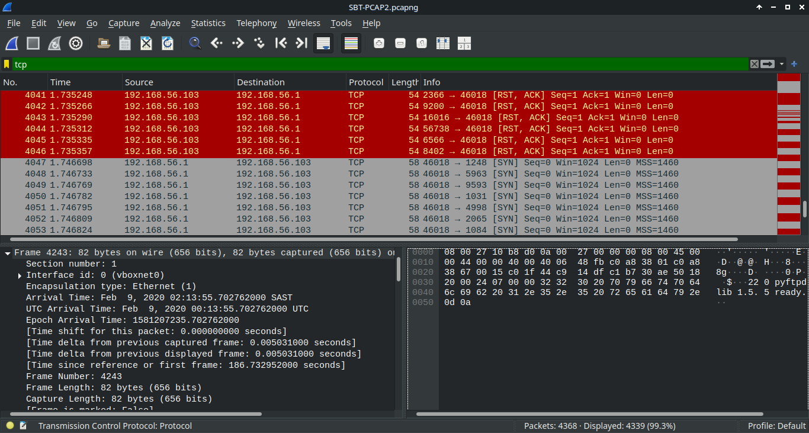
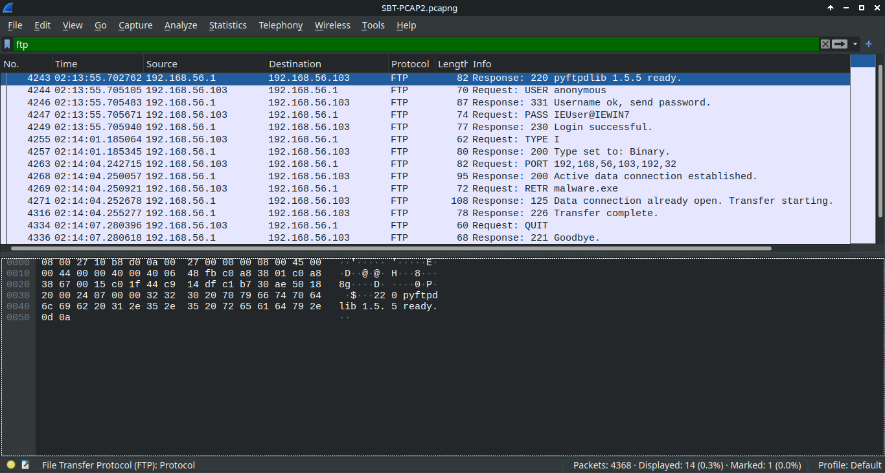
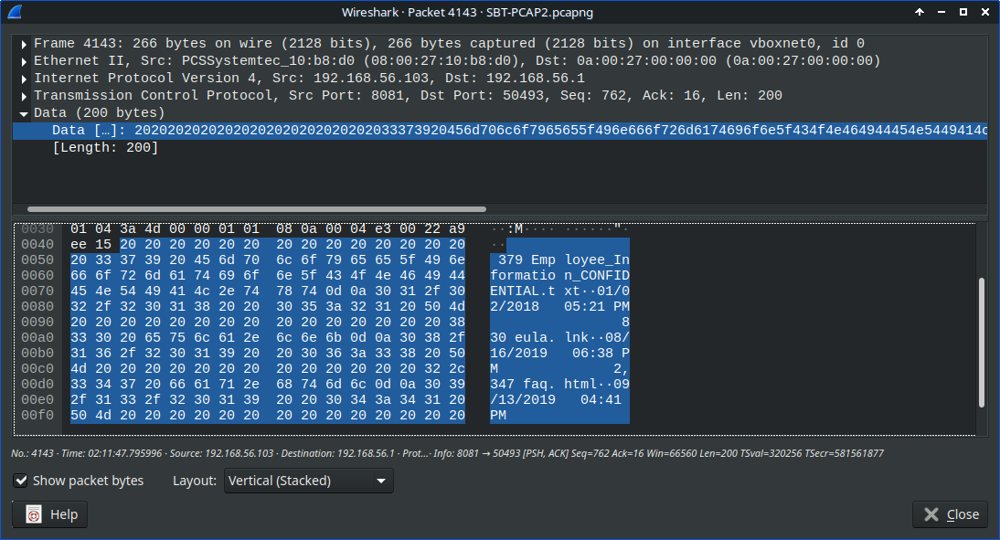

# Network Traffic Analysis Investigation Report
## Unauthorized FTP Access via Credential Exposure

**Investigator:** Lerato Makhasane  
**Date:** May 10, 2026  
**Platform:** Security Blue Team – Network Analysis Exercise  
**Tools Used:** Wireshark 4.x  

---

## 1. Executive Summary

An attacker gained unauthorized access to a Windows 7 system by capturing credentials transmitted in plaintext over HTTP. Using the compromised credentials, the attacker authenticated to an FTP service and accessed sensitive employee data. The attack occurred over a 3-minute window and required no exploitation of vulnerabilities—only insecure protocol usage.

---

## 2. Scope

| Category | Details |
|----------|---------|
| Evidence Sources | PCAP1.pcap, PCAP2.pcap |
| Investigation Type | Network Traffic Analysis / Unauthorized Access |
| Environment | Controlled Lab Environment |
| Analysis Tools | Wireshark 4.x |
| Analysis Period | ~04:48 AM – 04:51 AM |

---

## 3. Key Entities

| Entity Type | Value |
|-------------|-------|
| Attacker IP | 192.168.56.1 |
| Victim IP | 192.168.56.103 |
| Victim Hostname | IEWIN7 |
| Protocols Used | HTTP, FTP, DNS, ICMP, SSDP |
| FTP Server | pyftpdlib 1.5.5 (port 8081) |
| Compromised Account | WebAdmin |
| Compromised Password | sbt123 |
| Sensitive File | Employee_Information_CONFIDENTIAL.txt |

---

## 4. Timeline of Events

| Time | Event | Actor | Evidence |
|------|-------|-------|----------|
| 04:48 AM | Victim transmits plaintext credentials over HTTP | VICTIM | HTTP stream capture |
| 04:49 AM | Attacker captures password (`sbt123`) | ATTACKER | HTTP packet analysis |
| 04:50 AM | Attacker authenticates to FTP (port 8081) | ATTACKER | FTP `230 Login successful` |
| 04:51 AM | Attacker retrieves `malware.exe` | ATTACKER | FTP `RETR` command |
| 04:51 AM | Attacker accesses `Employee_Information_CONFIDENTIAL.txt` | ATTACKER | FTP `RETR` command |
| 04:51 AM | Victim FTP service logs session activity | VICTIM | LogFile.log creation |

---

## 5. Initial Traffic Analysis

### Protocol Overview

Protocol hierarchy analysis identified HTTP and FTP traffic as central to the investigation. The presence of unencrypted protocols indicated potential security weaknesses.

**Key Observations:**
- HTTP traffic contained authentication data
- FTP traffic operated on non-standard port 8081
- No encrypted protocols (HTTPS/SFTP) observed

---

## 6. Attack Reconstruction

### 6.1 Victim Transmits Credentials in Plaintext

**Evidence:**

**Analysis:**

The victim system transmitted authentication credentials over HTTP without encryption. The HTTP stream revealed:
- Username: `WebAdmin`
- Password: `sbt123`

**Assessment:**

The use of HTTP for credential transmission allowed the attacker to capture authentication data through passive network monitoring. No exploitation or active attack was required—the credentials were transmitted in plaintext.

---

### 6.2 Attacker Establishes Connection to Victim

**Evidence:**

**Analysis:**

Network traffic analysis identified communication between:
- Source: 192.168.56.1 (attacker)
- Destination: 192.168.56.103 (victim, hostname: IEWIN7)

**Assessment:**

The attacker initiated contact with the victim system following credential capture. This communication established the session used for subsequent unauthorized access.

---

### 6.3 Attacker Authenticates to FTP Service

**Evidence:**

**Analysis:**

The attacker successfully authenticated to the victim's FTP service using the captured credentials:
- FTP server: pyftpdlib 1.5.5
- Port: 8081 (non-standard)
- Server response: `230 Login successful`

**Assessment:**

The captured credentials were valid and provided the attacker with authenticated access to the victim's file system via FTP. The use of a non-standard port (8081) may indicate an attempt to evade basic security controls.

---

### 6.4 Attacker Retrieves Malware and Accesses Confidential Employee Data

**Evidence:**

**Analysis:**

Following successful authentication, the attacker issued multiple FTP commands:
- `RETR malware.exe` – downloaded malicious executable
- `RETR Employee_Information_CONFIDENTIAL.txt` – accessed sensitive employee data

**Assessment:**

The attacker actively retrieved files from the victim system, including:
1. **Malware deployment** – The retrieval of `malware.exe` suggests the attacker either planted malware for persistence or retrieved malware for analysis
2. **Data exposure** – Access to `Employee_Information_CONFIDENTIAL.txt` indicates potential compromise of sensitive organizational data

The combination of malware retrieval and confidential file access demonstrates both immediate impact (data exposure) and potential persistent threat (malware deployment).

---

### 6.5 Victim System Logs FTP Session Activity

**Evidence:**

**Analysis:**

The victim's FTP service generated `LogFile.log` at 04:51 AM, recording the attacker's session activity.

**Assessment:**

The presence of session logging provides a secondary evidence source for confirming:
- Timing of unauthorized access
- Commands issued during the session
- Files accessed by the attacker

This log file may contain additional forensic artifacts not visible in packet capture alone, such as file modification timestamps or additional attacker commands.

---

## 7. Security Findings

### 7.1 Cleartext Credential Exposure (HIGH)

**Evidence:** HTTP stream exposed plaintext username and password

**Impact:**
- Enabled unauthorized access without requiring exploitation
- Credentials can be captured through passive network monitoring
- No user interaction required for credential compromise

**Technical Details:**
- Protocol: HTTP (unencrypted)
- Credentials transmitted: Username `WebAdmin`, password `sbt123`
- Attack vector: Passive network sniffing

---

### 7.2 Insecure File Transfer Protocol Usage (HIGH)

**Evidence:** FTP used for authentication and file transfer

**Impact:**
- Authentication credentials transmitted in cleartext
- File contents transmitted without encryption
- Session vulnerable to man-in-the-middle attacks

**Technical Details:**
- Protocol: FTP (unencrypted)
- Server: pyftpdlib 1.5.5
- Files transferred: `malware.exe`, `Employee_Information_CONFIDENTIAL.txt`

---

### 7.3 Non-Standard FTP Port Usage (MEDIUM)

**Evidence:** FTP service operating on port 8081

**Impact:**
- May evade basic firewall rules expecting FTP on port 21
- May bypass simple network monitoring focused on standard ports
- Indicates potential security control evasion

**Technical Details:**
- Expected FTP port: 21
- Observed FTP port: 8081

---

### 7.4 Sensitive File Exposure (HIGH)

**Evidence:** Attacker accessed `Employee_Information_CONFIDENTIAL.txt`

**Impact:**
- Potential compromise of employee personal information
- Possible regulatory compliance violation (POPIA, GDPR)
- Reputational damage risk

**Technical Details:**
- File accessed: `Employee_Information_CONFIDENTIAL.txt`
- Access method: FTP `RETR` command
- File contents: Unknown (not transmitted in captured traffic)

---

## 8. Impact Assessment

| Security Principle | Impact Level | Justification |
|-------------------|--------------|---------------|
| **Confidentiality** | **HIGH** | Credentials compromised, sensitive employee data accessed |
| **Integrity** | **MEDIUM** | Malware retrieved (potential system modification) |
| **Availability** | **LOW** | No evidence of service disruption or denial of service |

**Overall Risk:** **HIGH**

---

## 9. Recommendations

### Immediate Actions

1. **Credential Reset**
   - Force password reset for `WebAdmin` account
   - Audit all accounts with similar credential exposure risk
   - Implement temporary access restrictions

2. **Incident Response**
   - Isolate affected system (192.168.56.103)
   - Conduct forensic imaging before remediation
   - Analyze `malware.exe` in isolated environment

### Short-Term Actions (1-30 days)

3. **Enforce HTTPS**
   - Disable HTTP for all credential-transmitting applications
   - Implement TLS 1.2+ for web services
   - Deploy HTTP Strict Transport Security (HSTS)

4. **Replace FTP with Secure Alternatives**
   - Migrate to SFTP (SSH File Transfer Protocol)
   - Alternatively, implement FTPS (FTP over SSL/TLS)
   - Disable legacy FTP service

5. **Implement Network Monitoring**
   - Deploy intrusion detection system (IDS)
   - Configure alerts for cleartext credential transmission
   - Monitor for unauthorized FTP/HTTP activity

### Long-Term Actions (30-90 days)

6. **Access Control Hardening**
   - Implement principle of least privilege
   - Restrict file access based on role requirements
   - Deploy data loss prevention (DLP) controls

7. **Port Security Audit**
   - Inventory all services on non-standard ports
   - Document legitimate services
   - Block unauthorized port usage

8. **Security Awareness Training**
   - Educate staff on credential security
   - Highlight risks of unencrypted protocols
   - Implement phishing and social engineering training

---

## 10. Lessons Learned

### What Worked

- **Timeline-first approach** – Building the attack timeline before detailed analysis provided clear investigative structure
- **Protocol filtering refinement** – Iterative filter adjustment (e.g., `dns.flags.response==1`) eliminated noise and focused on relevant traffic
- **Evidence labeling discipline** – Clear screenshot naming and referencing improved report clarity

### What Could Be Improved

- **Initial protocol assumptions** – Started with `tcp.port==3942` before confirming SSDP uses UDP
- **Screenshot efficiency** – Early investigation captured too many tool screenshots rather than attack evidence
- **Investigative focus** – Initially approached as exercise question-answering rather than attack narrative reconstruction

### Key Takeaways for Next Investigation

1. **Verify protocol assumptions early** – Use Wireshark's protocol hierarchy statistics before applying port filters
2. **Build timeline before deep analysis** – Temporal sequence provides investigative framework
3. **Evidence minimalism** – One screenshot per finding, not per tool interaction
4. **Attribution clarity** – Every piece of evidence should identify attacker vs. victim actions

---

## 11. Conclusion

This investigation demonstrated how insecure protocol usage enables unauthorized access without requiring advanced exploitation techniques. The attack chain relied entirely on protocol weaknesses:

1. HTTP transmitted credentials in plaintext
2. Attacker captured credentials through passive monitoring
3. FTP allowed authenticated access without encryption
4. Attacker accessed sensitive files and retrieved malware

The investigation confirmed:
- **Unauthorized access:** Yes
- **Credential compromise:** Yes
- **Data exposure:** Yes (confidential employee information)
- **Attack complexity:** Low (passive credential capture, standard authentication)

**Primary Root Cause:** Use of unencrypted protocols (HTTP, FTP) for credential transmission and file transfer.

**Recommended Priority:** Immediate migration to encrypted protocols (HTTPS, SFTP) and credential reset for exposed accounts.

---

## 12. Appendices

### Appendix A: Investigation Methodology

**Analysis Tools:**
- Wireshark 4.x (primary analysis platform)
- Protocol hierarchy statistics
- Stream following (HTTP, FTP)
- Display filters for protocol-specific analysis

**Evidence Sources:**
- PCAP1.pcap – Initial traffic capture
- PCAP2.pcap – Extended traffic capture

**Analysis Approach:**
1. Protocol hierarchy overview
2. Timeline construction
3. Credential exposure identification
4. Attack chain reconstruction
5. Evidence correlation
6. Impact assessment

### Appendix B: Key Wireshark Filters Used

---

## Protocol-specific filters

dns.flags.response==1 # DNS responses only 
ftp # All FTP traffic 
http # All HTTP traffic
udp.port==3942 # SSDP traffic

## Investigation-specific filters

ip.addr==192.168.56.1 # Attacker traffic 
ip.addr==192.168.56.103 # Victim traffic 
tcp.port==8081 # Non-standard FTP port

### Appendix C: File Inventory

**Evidence Files:**
- `Employee_Information_CONFIDENTIAL.txt` – Sensitive file accessed by attacker
- `malware.exe` – Malicious executable retrieved by attacker
- `LogFile.log` – FTP session log generated by victim system

---

## Disclaimer

This investigation was conducted in a controlled lab environment as part of Security Blue Team training. All findings are based on simulated data. No real systems or networks were compromised.

---

**Investigator:** Lerato Makhasane  
**GitHub:** [github.com/leratomakhasane](https://github.com/leratomakhasane)  
**LinkedIn:** [linkedin.com/in/leratomakhasane](https://linkedin.com/in/leratomakhasane)
